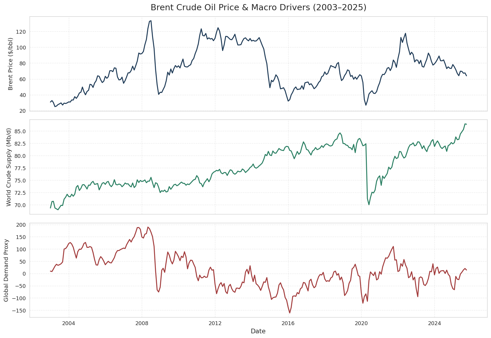
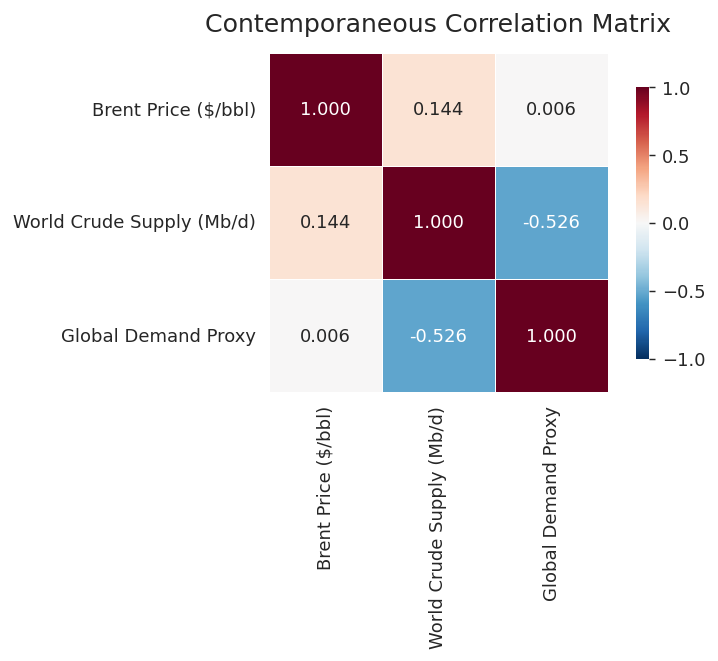
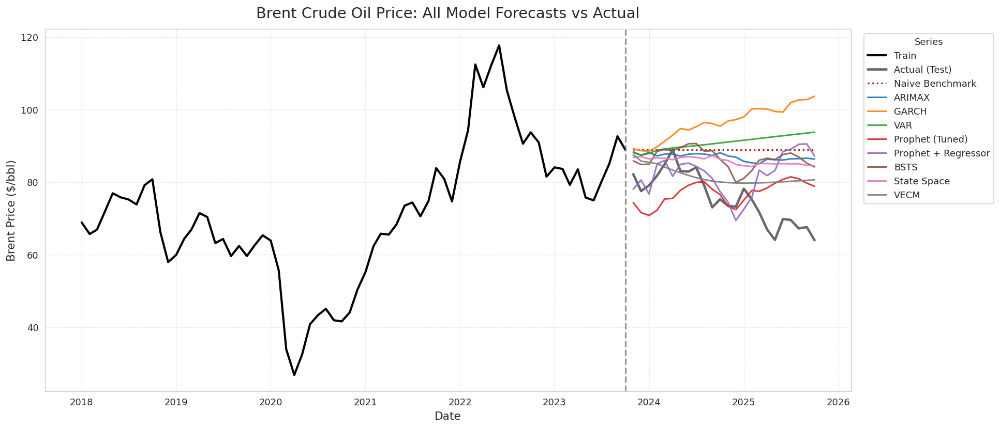
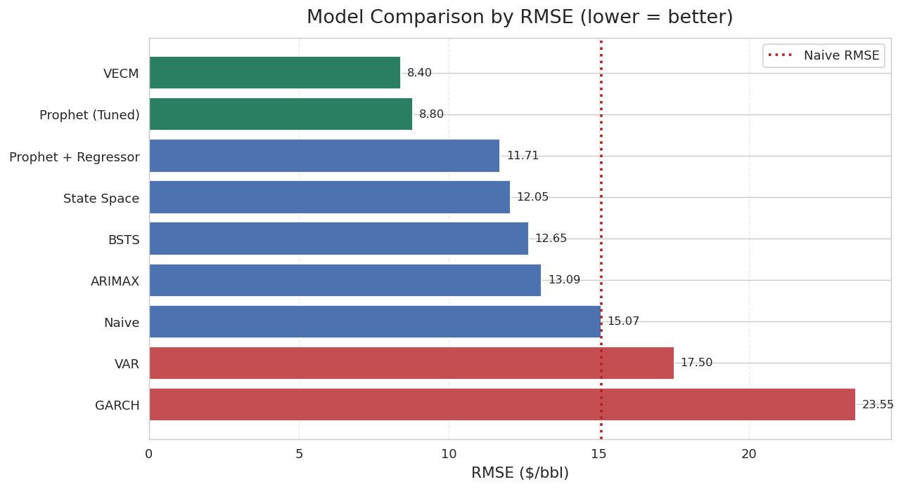
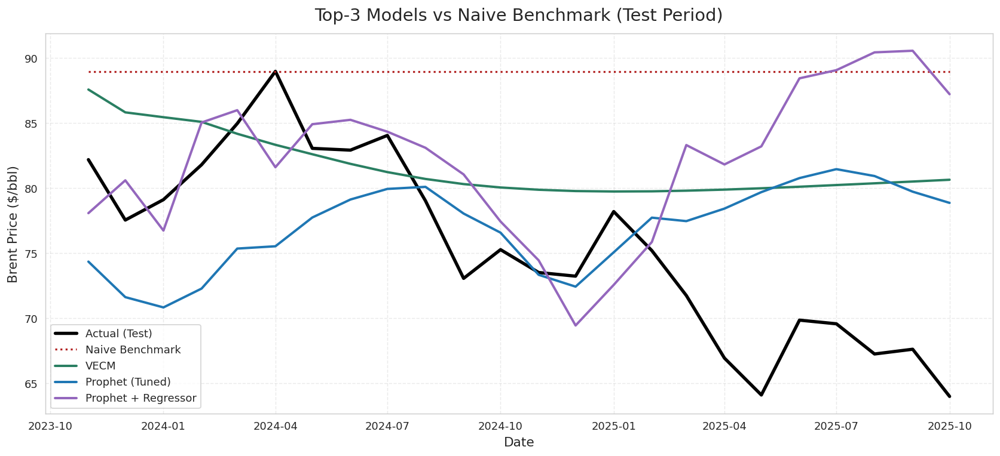

# Forecasting Brent Crude Oil Prices: A Multi-Model Time Series Study

A comparative time series analysis that forecasts monthly **Brent crude oil prices** using nine modeling approaches, from classical econometric models to Bayesian structural and machine-learning-style methods. Each model is trained on 20+ years of data and evaluated on a held-out 24-month test window against a naive benchmark.

The headline result: a **Vector Error Correction Model (VECM)** and a **tuned Prophet** model were the only approaches to meaningfully and consistently beat the naive last-value benchmark, cutting forecast error by roughly **40–45%**.

---

## Overview

Crude oil prices are notoriously difficult to forecast: they respond to supply and demand shocks with lags, exhibit long stretches of mean-reverting behavior punctuated by sharp regime shifts, and are influenced by macro-financial conditions that are themselves hard to predict. This project frames the problem as a structured forecasting competition. A single, consistently prepared dataset is fed to a wide range of models, and every model is scored on the same out-of-sample test set using the same battery of error metrics.

**Target variable:** Global price of Brent Crude (USD per barrel, monthly).

**Exogenous drivers:**
- **World crude oil supply** (million barrels/day), from EIA international production data.
- **Kilian Global Real Economic Activity Index**, a widely used proxy for global demand for industrial commodities, derived from ocean freight rates.

**Sample:** 274 monthly observations spanning **January 2003 to October 2025**.

**Train / test split:** The last 24 months are reserved for evaluation.
- **Train:** 2003-01 to 2023-10 (250 observations)
- **Test:** 2023-11 to 2025-10 (24 observations)

---

## Data

All data was sourced programmatically and merged into a single aligned monthly panel (`final_df.csv`).

| Series | Source | Units |
|---|---|---|
| Brent Crude Oil Price | FRED (`fredapi`) | USD / barrel |
| World Crude Oil Supply | U.S. EIA, International Petroleum & Other Liquids Production | Million barrels / day |
| Global Demand Proxy | Kilian Global Real Economic Activity Index | Index (freight-rate based) |

### Descriptive statistics

| | Brent Price ($/bbl) | World Supply (Mb/d) | Demand Proxy |
|---|---:|---:|---:|
| Mean | 72.38 | 77.58 | 11.24 |
| Std. Dev. | 25.38 | 4.05 | 70.35 |
| Min | 25.04 | 68.98 | −161.10 |
| Max | 133.59 | 86.43 | 189.59 |

The price series shows substantial volatility over the sample, including the 2008 financial crisis, the 2014–2016 oil glut, the 2020 COVID demand collapse, and the 2022 post-invasion spike, making it a demanding forecasting target.

---

## Exploratory Data Analysis

The three series are plotted below over the full sample. The Brent price series displays a changing mean with relatively stable variance, large shock-driven swings, and clear mean-reversion following spikes. Supply trends gradually upward, while the demand proxy is the most volatile and erratic of the three.



Contemporaneous correlations between the three series are weak. This is consistent with oil-market dynamics, where prices respond to supply and demand with lags rather than simultaneously. The strongest relationship is a moderate **negative** correlation between supply and the demand proxy.



### Stationarity

Augmented Dickey-Fuller (ADF) and KPSS tests were run on each series in levels and after differencing:

- **Brent price**: borderline in levels (ADF p ≈ 0.046, KPSS p ≈ 0.10); treated as needing differencing given the visual evidence of a shifting mean.
- **World crude supply** and **demand proxy**: non-stationary in levels.
- After **first differencing**, all three series are stationary by both tests.

ACF/PACF inspection of the differenced Brent price pointed toward an **ARIMA(1,1,0)** baseline specification with no strong seasonality (so a seasonal SARIMA term was not required). The supply and demand series showed cyclical structure at half-year lags, which informed the multivariate models.

---

## Models

Nine forecasting approaches were implemented and evaluated, spanning four methodological families:

**Classical / univariate**
- **ARIMAX**: ARIMA on the differenced price with exogenous regressors (supply, demand).
- **GARCH**: volatility model used to construct a mean-and-variance price forecast with intervals.

**Multivariate econometric**
- **VAR**: Vector Autoregression on the jointly stationary (differenced) system.
- **VECM**: Vector Error Correction Model, capturing the long-run cointegrating relationship between price, supply, and demand.

**Decomposition / additive**
- **Prophet (Tuned)**: Facebook Prophet with hyperparameter tuning.
- **Prophet + Regressor**: Prophet augmented with the macro drivers as external regressors.

**Bayesian / state-space**
- **BSTS**: Bayesian Structural Time Series with credible intervals.
- **State Space (SARIMAX)**: state-space formulation of the SARIMAX model.

**Benchmark**
- **Naive**: last observed training value carried forward across the test horizon. Any model that cannot beat this is not adding value.

---

## Results

All models were scored on the 24-month test window (2023-11 to 2025-10). Metrics reported: Mean Absolute Error (MAE), Root Mean Squared Error (RMSE), Mean Absolute Percentage Error (MAPE), symmetric MAPE (sMAPE), and Mean Absolute Scaled Error (MASE, scaled against a seasonal-naive baseline, where values below 1.0 beat that baseline).

| Model | MAE | RMSE | MAPE (%) | sMAPE (%) | MASE |
|:---|---:|---:|---:|---:|---:|
| **VECM** | **6.97** | **8.41** | **9.82** | **9.16** | **0.346** |
| **Prophet (Tuned)** | 7.42 | 8.80 | 10.17 | 9.82 | 0.368 |
| Prophet + Regressor | 8.50 | 11.71 | 12.16 | 10.93 | 0.422 |
| State Space | 10.51 | 12.05 | 14.75 | 13.40 | 0.522 |
| BSTS | 10.96 | 12.65 | 15.35 | 13.86 | 0.544 |
| ARIMAX | 11.53 | 13.09 | 16.15 | 14.56 | 0.572 |
| *Naive (benchmark)* | *13.41* | *15.07* | *18.74* | *16.68* | *0.665* |
| VAR | 15.34 | 17.50 | 21.50 | 18.77 | 0.761 |
| GARCH | 20.93 | 23.55 | 29.22 | 24.53 | 1.039 |

*Sorted by RMSE (lower is better). The naive benchmark is italicized as the line every model must clear.*

The visualization below shows every model's forecast against the actual test path. Several models drift upward or stay flat near the train's final level, while the actual price trends downward across 2024–2025. The models that track the decline most closely are the ones that win.



Ranking the models by RMSE makes the separation clear. VECM and tuned Prophet sit well below the naive line; VAR and GARCH fall below it (i.e., worse than simply carrying the last value forward).



Zooming into the test window for the top performers shows how closely VECM and tuned Prophet capture the downward trajectory that the naive benchmark misses entirely.



### Key takeaways

- **VECM is the best model**, with the lowest error on every metric (RMSE ≈ 8.4, MAPE ≈ 9.8%, MASE ≈ 0.35). Modeling the long-run cointegrating relationship between price, supply, and demand pays off over a two-year horizon.
- **Tuned Prophet** is a close second and the strongest of the non-econometric approaches, showing that careful hyperparameter tuning matters more than simply adding regressors; the regressor-augmented Prophet actually performed worse.
- **Six of nine models beat the naive benchmark.** Most approaches add real value, but it is not automatic.
- **VAR and GARCH underperform the naive benchmark.** A plain VAR on the differenced system and a volatility-focused GARCH forecast both failed to capture the level dynamics over this horizon, a useful reminder that more complex is not always better.
- **MASE < 1.0 for the top six models** confirms they beat a seasonal-naive baseline; GARCH (MASE ≈ 1.04) does not.

---

## Repo Contents

```
.
├── README.md
│
├── notebooks/
│   ├── Project_Data_Preparation_EDA.ipynb     # Data sourcing, merging, EDA, stationarity tests, train/test split
│   ├── SARIMAX_model.ipynb                     # ARIMAX / SARIMAX state-space modeling
│   ├── VAR_model.ipynb                         # VAR and VECM multivariate models
│   ├── Prophet_Model.ipynb                     # Prophet baseline and tuning
│   ├── Prophet_and_garch_Model.ipynb          # Prophet + regressors and GARCH volatility model
│   ├── BSTS_Model.ipynb                        # Bayesian Structural Time Series
│   └── Forecasts_Combined__All_Models_.ipynb  # Combines all forecasts, plots, computes final metrics
│
├── data/
│   └── final_df.csv                            # Merged monthly panel: Brent price, supply, demand proxy (2003–2025)
│
├── forecasts/
│   ├── var_forecast.csv                        # VAR test-period forecasts vs actual
│   ├── vecm_forecast.csv                       # VECM test-period forecasts vs actual
│   ├── sarimax_forecast.csv                    # ARIMAX forecasts with prediction intervals
│   ├── prophet_forecast.csv                    # Prophet (base, tuned, +regressor) forecasts with intervals
│   ├── garch_forecast.csv                      # GARCH returns/volatility/price forecasts with intervals
│   ├── bsts_forecast.csv                       # BSTS forecasts with credible intervals
│   └── state_space_predictions.csv             # State-space (SARIMAX) predictions
│
└── figures/
    ├── 01_series_overview.png                  # Three series over the full sample
    ├── 02_correlation.png                      # Correlation matrix
    ├── 03_all_models.png                       # All model forecasts vs actual
    ├── 04_top3.png                             # Top-3 models vs naive (test window)
    └── 05_rmse_bar.png                         # Model ranking by RMSE
```

> **Note:** The notebooks were developed in Google Colab and read data via mounted Google Drive paths. To run them locally, update the file paths in the data-loading cells to point at the `data/` and `forecasts/` folders in this repository.

---

## Methodology Summary

1. **Collect & align** three monthly series (price, supply, demand proxy) into one panel spanning 2003–2025.
2. **Explore** the data: distributions, trends, correlations, and volatility regimes.
3. **Test stationarity** with ADF and KPSS; difference where needed; inspect ACF/PACF to inform model orders.
4. **Split** off the final 24 months as an untouched test set.
5. **Fit nine models** across four methodological families on the training data.
6. **Forecast** the 24-month test horizon with each model (intervals where available).
7. **Score** every model on identical metrics against the actuals and the naive benchmark.
8. **Compare & conclude**: identify which models add genuine forecasting value and why.

---

## Tech Stack

- **Python**: `pandas`, `numpy`
- **Econometrics & forecasting**: `statsmodels` (ARIMA/SARIMAX, VAR/VECM, state space), `prophet`, `arch` (GARCH), `tensorflow-probability`/BSTS tooling, `sktime`
- **Data access**: `fredapi`, EIA data
- **Visualization**: `matplotlib`, `seaborn`
- **Evaluation**: `scikit-learn` metrics, custom MAPE / sMAPE / MASE implementations
